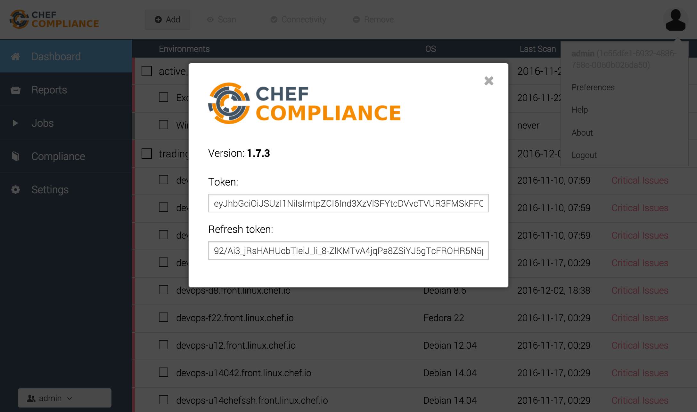
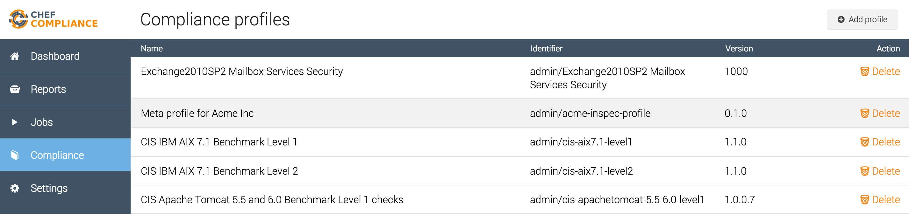
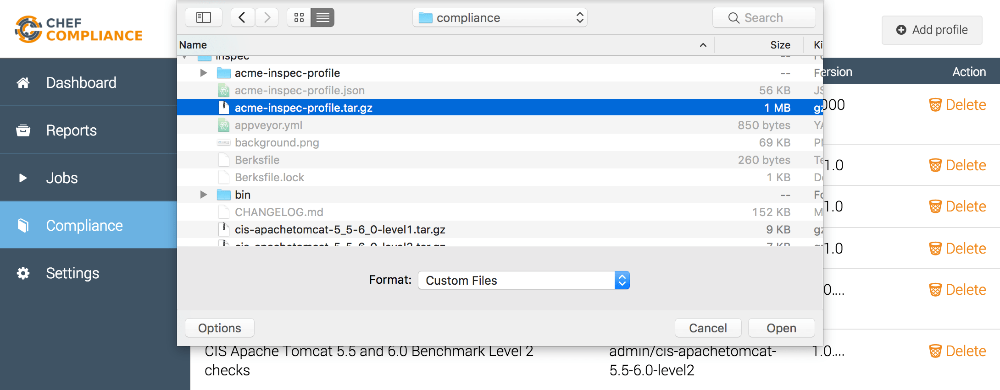
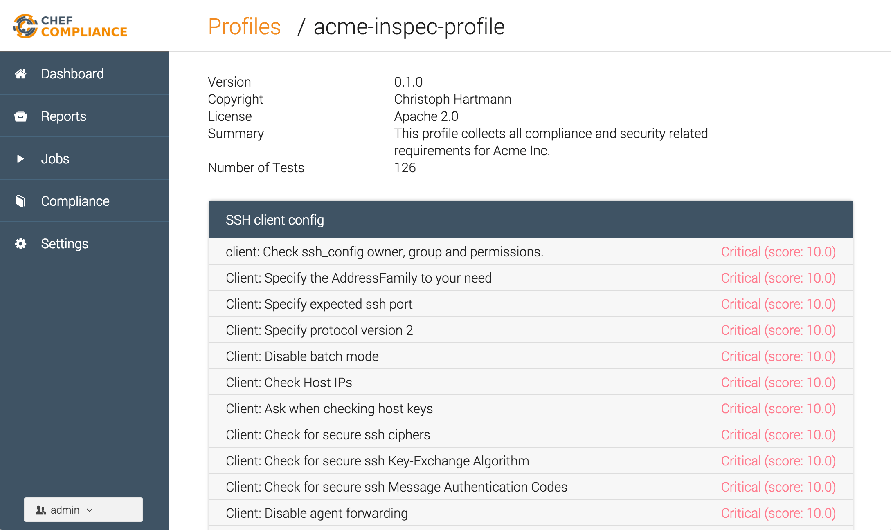
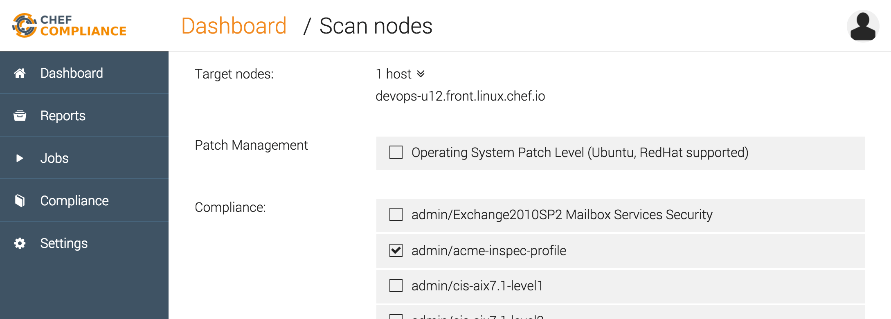

This article demonstrates InSpec's meta profile functionality in combination with Chef Compliance. This feature enables you to write profile overlays and to reuse controls from existing profiles. This is a great way to manage deviations of out-of-the-box profiles shipped with Chef Compliance.

## Meta Profiles

A meta profile is an overlay or a collection of multiple profiles. Examples are:

- a deviation from CIS benchmarks
- collection of all CIS profiles that apply to your infrastructure (eg. a company-wide profile)

The structure of a meta profile (e.g. [Acme InSpec profile](https://github.com/chris-rock/acme-inspec-profile)) is identical to any other InSpec profile:

```bash
$ tree acme-inspec-profile
acme-inspec-profile
├── LICENSE
├── README.md
├── controls
│   ├── hardening.rb
│   ├── patch.rb
│   └── ssl.rb
└── inspec.yml
```

InSpec `dependencies` are defined in `inspec.yml` via `depends`:

```bash
$ cat acme-inspec-profile/inspec.yml
name: acme-inspec-profile
title: Meta profile for Acme Inc
maintainer: Christoph Hartmann
copyright: Christoph Hartmann
copyright_email: chris@lollyrock.com
license: Apache 2.0
summary: This profile collects all compliance and security related requirements for Acme Inc.
version: 0.1.0
depends:
  - name: linux-patch-benchmark
    git: https://github.com/dev-sec/linux-patch-benchmark.git
  - name: windows-patch-benchmark
    git: https://github.com/dev-sec/windows-patch-benchmark.git
  - name: os-hardening
    git: https://github.com/dev-sec/tests-os-hardening.git
  - name: ssh-hardening
    git: https://github.com/dev-sec/tests-ssh-hardening.git
  - name: ssl-benchmark
    git: https://github.com/dev-sec/ssl-benchmark.git
```

In addition to `git` dependencies, InSpec supports `supermarket`, `url` and `compliance` dependencies as profile locations as well:

```yaml
depends:
  # defaults to supermarket
  - name: hardening/ssh-hardening  
  # remote tar or zip file
  - name: os-hardening
    url: https://github.com/dev-sec/tests-os-hardening/archive/master.zip
  # git
  - git: https://github.com/dev-sec/ssl-benchmark.git
  - name: windows-patch-benchmark
    git: https://github.com/chris-rock/windows-patch-benchmark.git
  # Chef Compliance / Chef Automate
  - name: linux
    compliance: base/linux
```

Once you depend on another profile, you can leverage all its controls in your meta profile. Additionally all custom InSpec resources are available as well, in case you want to define new controls.

```bash
$ cat acme-inspec-profile/controls/hardening.rb
# encoding: utf-8
#
# Licensed under the Apache License, Version 2.0 (the "License");
# you may not use this file except in compliance with the License.
# You may obtain a copy of the License at
#
#     http://www.apache.org/licenses/LICENSE-2.0
#
# Unless required by applicable law or agreed to in writing, software
# distributed under the License is distributed on an "AS IS" BASIS,
# WITHOUT WARRANTIES OR CONDITIONS OF ANY KIND, either express or implied.
# See the License for the specific language governing permissions and
# limitations under the License.
#
# author: Christoph Hartmann
# author: Dominik Richter

# ensure linux servers are hardenend
include_controls 'os-hardening'
include_controls 'ssh-hardening'
```

InSpec provides `include_controls` and `require_controls` keywords to load controls from inherited profiles. By default, no controls are executed after you defined its dependency in `inspec.yml`. The parameter for `include_controls` eg. `os-hardening` matches the name in `inspec.yml`. In that specific case, we just import all controls from our dependency. Further documentation about this behavior   available at [InSpec Docs](http://inspec.io/docs/reference/profiles/). The dependency management functionality is specified in [RFC Dependencies](https://github.com/chef/inspec/issues/888)

## Vendoring

While InSpec allows runtime resolution of dependencies, customers want to ensure safety for their production environment. Some challenges I have seen very often:

- no internet is available in air-gapped environments
- new profile updates need to be tested before they are used in production
- integration in CI/CD pipelines

In order to help with those challenges, the InSpec team decided to establish a vendoring mechanism for profiles. This process is defined in [Vendor dependent profiles in archive](https://github.com/chef/inspec/issues/1283) and is composed of two steps:

- resolve all dependencies and their versions
- download all dependencies into `vendor` directory

Once those steps are finalized, an InSpec profile can be executed standalone without any internet connection available during runtime. Chef Compliance and Chef Automate prefer that approach over runtime profile resolution.

The lockfile `inspec.lock` looks similar to `inspec.yml`, but describes all version constraints.

```bash
cat acme-inspec-profile/inspec.lock
---
lockfile_version: 1
depends:
- name: linux-patch-benchmark
  resolved_source:
    git: https://github.com/dev-sec/linux-patch-benchmark.git
    ref: d53030317b711f36fa2fde9e18170ce6b4eaacf2
  version_constraints: ">= 0"
- name: windows-patch-benchmark
  resolved_source:
    git: https://github.com/dev-sec/windows-patch-benchmark.git
    ref: c183d08eb25638e7f5eac97e521640ea314c8e3d
  version_constraints: ">= 0"
- name: os-hardening
  resolved_source:
    git: https://github.com/dev-sec/tests-os-hardening.git
    ref: da3a1b6ce8a845d6818152a824e123c2445c355f
  version_constraints: ">= 0"
- name: ssh-hardening
  resolved_source:
    git: https://github.com/dev-sec/tests-ssh-hardening.git
    ref: 75754b9b3fe45c601f0fa0036b01c61c8b8e26d9
  version_constraints: ">= 0"
- name: ssl-benchmark
  resolved_source:
    git: https://github.com/dev-sec/ssl-benchmark.git
    ref: e17486c864434c818f96ca13edd2c5a420100a45
  version_constraints: ">= 0"
```

All dependencies are downloaded and stored in `vendor` directory.

```bash
tree acme-inspec-profile
acme-inspec-profile
├── LICENSE
├── README.md
├── controls
│   ├── hardening.rb
│   ├── patch.rb
│   └── ssl.rb
├── inspec.lock
├── inspec.yml
└── vendor
    ├── 75754b9b3fe45c601f0fa0036b01c61c8b8e26d9
    │   ├── CHANGELOG.md
    │   ├── Gemfile
    │   ├── README.md
    │   ├── Rakefile
    │   ├── controls
    │   │   ├── ssh_spec.rb
    │   │   └── sshd_spec.rb
    │   ├── inspec.yml
    │   └── libraries
    │       └── ssh_crypto.rb
    ├── c183d08eb25638e7f5eac97e521640ea314c8e3d
    │   ├── CONTRIBUTING.md
    │   ├── ChefCompliance.png
    │   ├── InSpec+Update.png
    │   ├── LICENSE
    │   ├── README.md
    │   ├── Windows+Update.png
    │   ├── controls
    │   │   └── patches.rb
    │   ├── inspec.yml
    │   └── libraries
    │       └── windows_updates.rb
    ├── d53030317b711f36fa2fde9e18170ce6b4eaacf2
    │   ├── CentOS+Patch.png
    │   ├── Gemfile
    │   ├── LICENSE
    │   ├── README.md
    │   ├── Rakefile
    │   ├── controls
    │   │   └── patches.rb
    │   ├── inspec.yml
    │   └── libraries
    │       └── linux_updates.rb
    ├── da3a1b6ce8a845d6818152a824e123c2445c355f
    │   ├── CHANGELOG.md
    │   ├── Gemfile
    │   ├── README.md
    │   ├── Rakefile
    │   ├── controls
    │   │   ├── os_spec.rb
    │   │   ├── package_spec.rb
    │   │   └── sysctl_spec.rb
    │   └── inspec.yml
    └── e17486c864434c818f96ca13edd2c5a420100a45
        ├── README.md
        ├── controls
        │   └── ssl_test.rb
        └── inspec.yml

15 directories, 43 files
```


## Execute a meta profile with Chef Compliance

In order to run meta profiles we need at least [Chef Compliance 1.7.3](https://discourse.chef.io/t/chef-compliance-1-7-3-inspec-1-7-1/9985). Next, just clone the  [Acme InSpec profile](https://github.com/chris-rock/acme-inspec-profile) via `git clone https://github.com/chris-rock/acme-inspec-profile`. We have two options to upload the profile to Chef Compliance:

- Upload via InSpec CLI
- Upload of archive via Chef Compliance Web UI

The first is the easiest since everything is done for you with one command.

### Upload via InSpec CLI

First, you need to login to Chef Compliance. You find your login token in Chef Compliance via the about dialog.

<p><center></center></p>

Use that token to login via InSpec CLI:

```bash
$ inspec compliance login https://compliance.test --insecure --user='admin' --token='eyJh....Jlqg'

API access token stored

$ git clone https://github.com/chris-rock/acme-inspec-profile
Cloning into 'acme-inspec-profile'...
remote: Counting objects: 12, done.
remote: Total 12 (delta 0), reused 0 (delta 0), pack-reused 12
Unpacking objects: 100% (12/12), done.
Checking connectivity... done.
```

Once you are logged in, you use the `compliance upload` command to package and upload the `acme-inspec-profile` profile for Chef Compliance.

```bash
$ inspec compliance upload acme-inspec-profile            
Vendor dependencies of acme-inspec-profile into acme-inspec-profile/vendor
I, [2016-12-06T10:24:43.899931 #90853]  INFO -- : Checking profile in acme-inspec-profile
I, [2016-12-06T10:24:43.900029 #90853]  INFO -- : Metadata OK.
`command(ssh).exist?` is not suported on your OS:
I, [2016-12-06T10:24:44.070233 #90853]  INFO -- : Found 120 controls.
W, [2016-12-06T10:24:44.070519 #90853]  WARN -- : Control verify-kb has no description
W, [2016-12-06T10:24:44.070555 #90853]  WARN -- : Control important-count has no description
W, [2016-12-06T10:24:44.070571 #90853]  WARN -- : Control important-patches has no description
W, [2016-12-06T10:24:44.070581 #90853]  WARN -- : Control important-patches has no tests defined
W, [2016-12-06T10:24:44.070591 #90853]  WARN -- : Control optional-count has no description
W, [2016-12-06T10:24:44.070601 #90853]  WARN -- : Control optional-patches has no description
W, [2016-12-06T10:24:44.070610 #90853]  WARN -- : Control optional-patches has no tests defined
W, [2016-12-06T10:24:44.070619 #90853]  WARN -- : Control verify-patches has no description
W, [2016-12-06T10:24:44.070629 #90853]  WARN -- : Control patches has no description
W, [2016-12-06T10:24:44.070638 #90853]  WARN -- : Control patches has no tests defined
Profile is valid
Generate temporary profile archive at /var/folders/jy/2bnrfb4s36jbjtzllvhhyqhw0000gn/T/acme-inspec-profile20161206-90853-kzpo1p.tar.gz
I, [2016-12-06T10:24:44.088457 #90853]  INFO -- : Generate archive /var/folders/jy/2bnrfb4s36jbjtzllvhhyqhw0000gn/T/acme-inspec-profile20161206-90853-kzpo1p.tar.gz.
I, [2016-12-06T10:24:44.194607 #90853]  INFO -- : Finished archive generation.
Start upload to admin/acme-inspec-profile
Uploading to Chef Compliance
Successfully uploaded profile
```

The profile is available in Chef Compliance now:

<p><center></center></p>

### Upload of archive via Chef Compliance Web UI

In cases, where you cannot upload the profile via CLI, you have to archive the profile manually. At first you trigger the vendoring process via `inspec vendor`

```bash
$ inspec vendor acme-inspec-profile
Vendor dependencies of acme-inspec-profile into acme-inspec-profile/vendor
```

Once the vendoring process is done, the `vendor` directory and the `inspec.lock` are placed in the `acme-inspec-profile` directory. Now, run `inspec archive` to generate a package.

```bash
$ inspec archive acme-inspec-profile
I, [2016-12-06T10:32:59.234327 #93241]  INFO -- : Checking profile in acme-inspec-profile
I, [2016-12-06T10:32:59.234422 #93241]  INFO -- : Metadata OK.
`command(ssh).exist?` is not suported on your OS:
I, [2016-12-06T10:32:59.376949 #93241]  INFO -- : Found 126 controls.
W, [2016-12-06T10:32:59.377156 #93241]  WARN -- : Control verify-kb has no description
W, [2016-12-06T10:32:59.377181 #93241]  WARN -- : Control important-count has no description
W, [2016-12-06T10:32:59.377199 #93241]  WARN -- : Control important-patches has no description
W, [2016-12-06T10:32:59.377214 #93241]  WARN -- : Control important-patches has no tests defined
W, [2016-12-06T10:32:59.377225 #93241]  WARN -- : Control optional-count has no description
W, [2016-12-06T10:32:59.377235 #93241]  WARN -- : Control optional-patches has no description
W, [2016-12-06T10:32:59.377243 #93241]  WARN -- : Control optional-patches has no tests defined
W, [2016-12-06T10:32:59.377253 #93241]  WARN -- : Control verify-patches has no description
W, [2016-12-06T10:32:59.377262 #93241]  WARN -- : Control patches has no description
W, [2016-12-06T10:32:59.377277 #93241]  WARN -- : Control patches has no tests defined
W, [2016-12-06T10:32:59.377294 #93241]  WARN -- : Control tls1.2 has no description
W, [2016-12-06T10:32:59.377329 #93241]  WARN -- : Control tls1.2 has no tests defined
W, [2016-12-06T10:32:59.377339 #93241]  WARN -- : Control ssl2 has no description
W, [2016-12-06T10:32:59.377392 #93241]  WARN -- : Control ssl2 has no tests defined
W, [2016-12-06T10:32:59.377408 #93241]  WARN -- : Control ssl3 has no description
W, [2016-12-06T10:32:59.377419 #93241]  WARN -- : Control ssl3 has no tests defined
W, [2016-12-06T10:32:59.377429 #93241]  WARN -- : Control tls1.0 has no description
W, [2016-12-06T10:32:59.377441 #93241]  WARN -- : Control tls1.0 has no tests defined
W, [2016-12-06T10:32:59.377480 #93241]  WARN -- : Control tls1.1 has no description
W, [2016-12-06T10:32:59.377536 #93241]  WARN -- : Control tls1.1 has no tests defined
W, [2016-12-06T10:32:59.377567 #93241]  WARN -- : Control rc4 has no description
W, [2016-12-06T10:32:59.377586 #93241]  WARN -- : Control rc4 has no tests defined
I, [2016-12-06T10:32:59.378081 #93241]  INFO -- : Generate archive /Users/chartmann/Development/compliance/inspec/acme-inspec-profile.tar.gz.
I, [2016-12-06T10:32:59.486476 #93241]  INFO -- : Finished archive generation.
```

<p><center></center></p>

### Scan a node

Voilà, the profile is available in Chef Compliance:

<p><center></center></p>

The profile can be selected for remote scans via the Chef Compliance dashboard:

<p><center></center></p>

Once the scan is done, you'll see a report including controls from all dependent profiles:



## Summary

We've seen how meta profiles are defined and executed. The new meta profile mechanism makes it easy for users to define complex scenarios and manage profile deviations in an easy and understandable way. Inline with the InSpec philosophy, everything is defined as `Compliance as Code`.

Let me know how that works for you!

