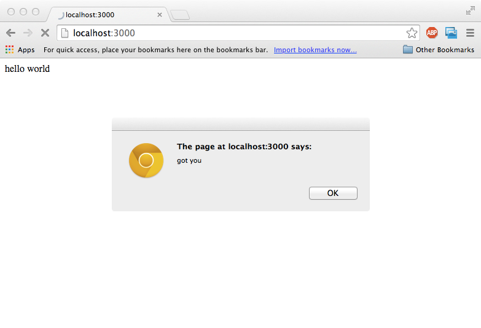
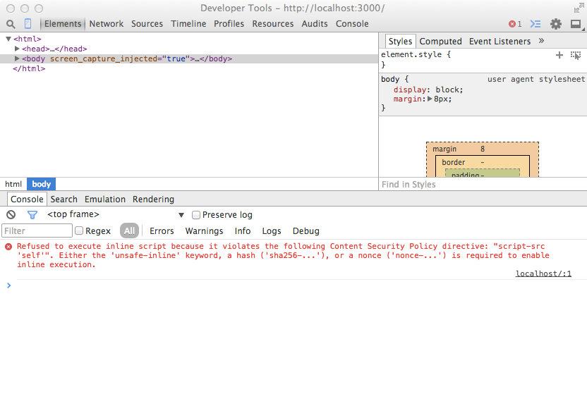

Some years ago it was common that users deactivated JavaScript to reduce the security risk of their browser. Nowadays HTML5 (JavaScript, CSS in combination with AJAX) is required to provide superior user experience. Users have no chance to deactivate JavaScript and expect the same kind of quality. Web Developers (and I am for sure part of it) on the other hand just add a simple `noscript` and think they are done. In most cases Web Developers live with the credo: "JavaScript is essential. There is no web without."

```html
<noscript>
    My Website does not support browsers without JavaScript disabled. 
    We promise we'll behave.
</noscript>
```

Do not get me wrong. I love JavaScript, but I care about security, too. This simple requirement defined by the web developer changes one fact: 

*Now, the web developer is responsible for the security of his JavaScript.*

Yes, he may behave. But what happens if the users do not behave? Just take a look at [XSS Filter Evasion Cheat Sheet](https://www.owasp.org/index.php/XSS_Filter_Evasion_Cheat_Sheet). In most cases some inline script is enough to try cross-site scripting attacks:

```html
<SCRIPT>alert("XSS");</SCRIPT>
```

The web developer is responsible to ensure, that all data is parsed and hardened against scripting attacks. Are you doing this? In most cases this sounds easier than thought. Do you check every input field? Even on client-side web apps? Are you sure?

To sum it up:
* We need JavaScript activated
* User needs to trust the web developers
* Web Developer is responsible to ensure the security for his users

## Solution

Luckily there exists a solution that helps web developers to increase the security level of his web page: the HTTP `Content Security Policy` header. And it is already supported by [64% of the browsers](http://caniuse.com/#feat=contentsecuritypolicy) and counting. 

**What is Content Security Policy (CSP)**

In general CSP is a white-list of sources that you trust as a web developer. Trust `Google Analytics`? Then you add it to your white-list. Trust `Facebook`? Add it to your white-list. Trust `https://evil.example.com`? For sure not. Just do not add it to your white-list. Sounds not to complicated right? A more in-depth description is available at [HTML5 Rocks](http://www.html5rocks.com/en/tutorials/security/content-security-policy/). 

Following, I am going to focus on the practical setup of CSP. For example, you may require fonts and images with data URLs. Those are quite common and need to be separately activated. 

Activate images with data urls:

    img-src 'self' data:;

The same applies for fonts:

    font-src 'self' data:;

Some JavaScripts frameworks depend a lot on inline css. If you require it (but please test without): 

    style-src 'self' 'unsafe-inline';

If you are using cross-domain AJAX requests you need to to add the domain to the white-list, eg. for Google Analytics. Be aware that you still need to implement CORS or JSONP to retrieve the data properly.

    connect-src 'self' https://apis.google.com;

Under all circumstances never ever, really, do not activate inline-scripts 

    # don't do this
    script-src 'self' 'unsafe-inline';
    # don't do this

Your code may require some changes and it takes some extra effort to create a JavaScript file even for simple code snippets. This extra effort drastically improves the security of your web page.

The following section shows configuration examples of `Content Security Policy` for Nginx and Nodejs. The same approach can be applied to other languages or web servers.

### Nginx

If your are using Nginx, a simple one-liner is enough to add `Content Security Policy`. Be aware that you need to test all edges of your web application after you activated this header. 

After the activation, the browser does not execute or display any content that is not allowed and this may break your web page.

*Attention: Caching applies here to. At least Chrome uses a quite aggressive caching strategy for the CSP header. A simple page reload may not be enough to change the browser behavior.*

A general good idea is to deactivate a much as possible and try to work out all issues. After you tried hard to fix all issues, start to relax the white-list. I'd like to repeat myself: *Under no circumstances activate Inline-JavaScript*.

A practical Nginx setup could look like:

```json
server {
    listen 80;
    listen [::]:80 default_server ipv6only=on;

    location / {

        # you can tell the browser that it can only download content from the domains you explicitly allow
        add_header Content-Security-Policy "default-src 'self'; script-src 'self'; img-src 'self' data:; style-src 'self' 'unsafe-inline'; font-src 'self' data:; frame-src 'self'; connect-src 'self' https://apis.google.com; object-src 'none' ";
        
        ...
    }
}
```

### Nodejs

I'll take Nodejs as an example for a web application, but the same can be applied to Ruby, Python, Scala etc.

In general I see four possibilities for Content Security Policy:

1. The web application is delivered with CSP already
2. You use the web application behind a proxy
3. Add the CSP header to your web framework like express
4. Use a convenience library like helmet in Nodejs

If your applications falls under possibility #1, verify the white-list and get some cup of coffee. The #2 possibility can be easily implemented with the Nginx approach mentioned above.

Now we deal with #3:

```
var express = require('express');
var app = express();

app.get('/', function(req, res){
    res.send("<html><body>hello world<script type='text/javascript'>alert('got you')</script></body><html>");
});

app.listen(3000);
```

To run this file, save it under `example-01.js`, run `npm install express` and execute `node example-01.js`. Open your browser at `http://localhost:3000/`



Now we are going to activate the `Content Security Policy`:

```
var express = require('express');
var app = express();

app.use(function(req, res, next){
    res.header("Content-Security-Policy", "default-src 'self';script-src 'self';object-src 'none';img-src 'self';media-src 'self';frame-src 'none';font-src 'self' data:;connect-src 'self';style-src 'self'");
    next();
});

app.get('/', function(req, res){
    res.send("<html><body><p>hello world</p><script type='text/javascript'>alert('got you')</script></body><html>");
});

app.listen(3000);
```

Try the sample again and you will receive an error code: 

```code
Refused to execute inline script because it violates the following 
Content Security Policy directive: "script-src 'self'". Either the 
'unsafe-inline' keyword, a hash ('sha256-...'), or a nonce ('nonce-...')
is required to enable inline execution.
```



For convenience, you may use a simple library called [helmet](https://www.npmjs.org/package/helmet). It works as mentioned above, but the code is easier to read and helmet offers some more security headers:

```javascript 
var express = require('express');
var app = express();
var helmet = require('helmet');

// @see https://github.com/evilpacket/helmet
// you should activate even more headers provided by helmet
app.use(helmet.csp({
    defaultSrc: ["'self'"],
    scriptSrc: ["'self'"],
    styleSrc: ["'self'"],
    imgSrc: ["'self'"],
    connectSrc: ["'self'"],
    fontSrc: ["'self'"],
    objectSrc: ["'none'"],
    mediaSrc: ["'self'"],
    frameSrc: ["'none'"],
    // reportUri: '/report-violation',
    reportOnly: false, // set to true if you only want to report errors
    setAllHeaders: false, // set to true if you want to set all headers
    safari5: false // set to true if you want to force buggy CSP in Safari 5
}));


app.get('/', function(req, res){
    res.send("<html><body><p>hello world</p><script type='text/javascript'>alert('got you')</script></body><html>");
});

app.listen(3000);

```

## Summary

As I described above, `Content Security Policy` is a good way to increase the security level of your web page. In most cases, the addition of the header is a no-brainer. You will have a few issues to work out and extensive testing is required after you activated the header. If you experience  lot of issues by implementing the `Content Security Policy` this may be an indication that you have to do some clean up work. CSP does not prevent you from fixing your XSS-Bugs, but it helps you to reduce the potential risk of a XSS Bug. Of course CSP is not the only security feature for your web application and you should really invest some time to secure your web page.

Do you need help to improve the security for your web application? Contact me via [Twitter @chri_hartmann](https://twitter.com/chri_hartmann) or [Github](https://github.com/chris-rock)

See also:

 * [Encrypt and decrypt content with Nodejs](http://lollyrock.com/articles/nodejs-encryption/)
 * [SHA 512 Hashs with nodejs](http://lollyrock.com/articles/nodejs-sha512/)
 * [Simple file uploads with Express 4](http://lollyrock.com/articles/express4-file-upload/)
 * [Ready for ES6?](http://arlimus.github.io/articles/ready.for.es6/)

## References

 * [An Introduction to Content Security Policy - HTML5 Rocks](http://www.html5rocks.com/en/tutorials/security/content-security-policy/)
 * [Introducing Content Security Policy](https://developer.mozilla.org/en-US/docs/Web/Security/CSP/Introducing_Content_Security_Policy)
 * [Content Security Policy](https://www.owasp.org/index.php/Content_Security_Policy)
 * [Content Security Policy 1.0](http://www.w3.org/TR/CSP/)
 * [Content Security Policy Level 2](http://www.w3.org/TR/CSP11/)
 * [Can I Use Content Security Policy](http://caniuse.com/#feat=contentsecuritypolicy)


