Every year at Christmas, I get some time to play with new exiting stuff. This year, I decided to play with my smart home devices. And of course, some *intelligent* personal assistant needs to be part of it.

Right now, I prefer devices from [AVM Fritz!](https://en.avm.de/products/fritzdect/) since their devices have a track record for long-term maintenance. They have one disadvantage though: A missing Apple HomeKit integration. Let's fix that.

## Goal

Before I start a project, I like to set its goal: Apple Siri needs to be able to manage my devices. At the end, I want to be able to ask her:

* Siri, *turn on* the Christmas tree
* Siri, *heat up* the dining room to *24 degrees celsius*

**Just remember**: a simple wall switch or thermostat is doing the same as this relatively complex setup with smart home devices, HomeKit bridge and network setup :-)

Siri is already tightly coupled with HomeKit, therefore we just have to register all Fritz! smart home devices in HomeKit. Sounds easy, right? 

I added some further restrictions:

* I want a HomeKit bridge that only manages Fritz! devices
* I want a single binary running as the service

## Prepare FritzBox

I am not going in detail about the Fritz!Box configuration. I assume you have prepared the box and registered your smart home devices properly. I recommend creating a special `smarthome` user in your Fritz!Box who has limited access to smart home devices only.

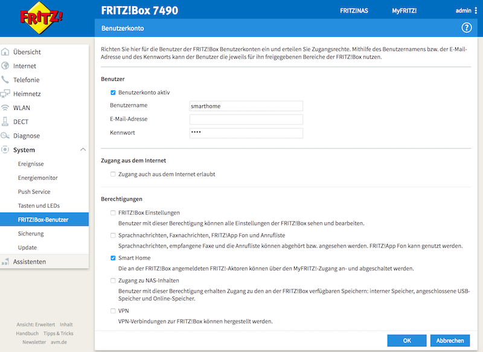

We are going to use that user and password for the HomeKit bridge in a minute. That is all.

## HomeKit for Fritz!Box

I've developed a [HomeKit bridge](https://github.com/chris-rock/homekit-fritz) in Go that is using the [Fritz!Box API](https://avm.de/fileadmin/user_upload/Global/Service/Schnittstellen/AHA-HTTP-Interface.pdf).

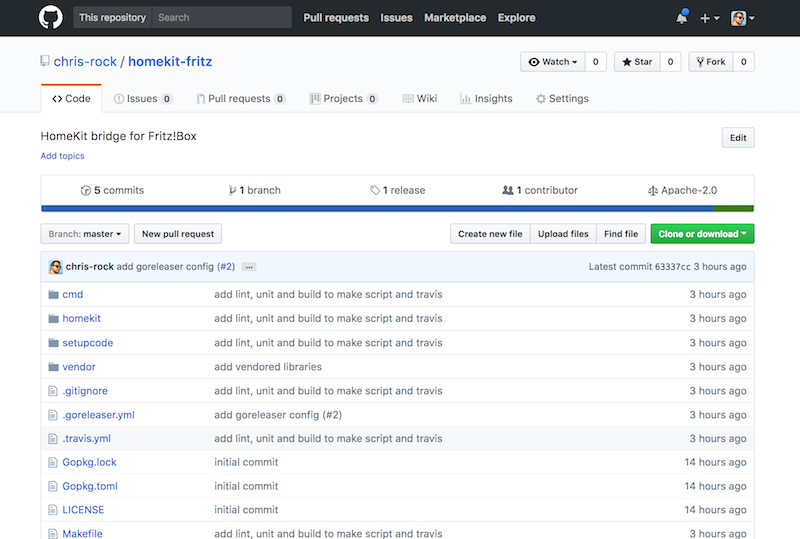

The implementation is based on two excellent go libraries:

- [HomeControl is an implementation of the HomeKit Accessory Protocol (HAP) in Go](https://github.com/brutella/hc)
- [fritzctl - console AVM FRITZ!Box client](https://github.com/bpicode/fritzctl)

Especially, HomeControl makes it very easy to create devices and show them in Apples Home app.

The most difficult piece was the support for [Apples setup code](https://theapplepips.com/homekit-gains-easier-setup-with-nfcqr-codes-improved-latency-support-for-sprinklersfaucets-more/), because it is not part of Apple's [Non-commercial HomeKit Accessory Protocol Specification](https://developer.apple.com/homekit/specification/). 

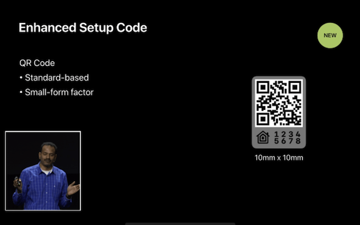

Thankfully, the excellent [homebridge
](https://github.com/nfarina/homebridge) project had already support for it. A couple of PRs to other projects later, the basic setup was up and running! Let's try it.

## Get it running

You will find pre-compiled binaries on [Github](https://github.com/chris-rock/homekit-fritz/releases), which makes the installation way easier, 


```
# Download and extract the hkfritz binary
$ mkdir hkfritz
$ curl -L https://github.com/chris-rock/homekit-fritz/releases/download/0.1.5/homekit-fritz_0.1.5_darwin_amd64.tar.gz | tar -xvzf -

# Configure the service
$ ./hkfritz configure
```

This will start the setup. You need to enter the Fritz!Box user and the password that we created above.

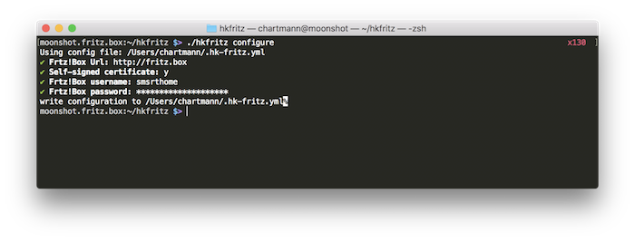

Now, we are ready to start the bridge:

```
# start the HomeKit bridge
$ ./hkfritz serve
```

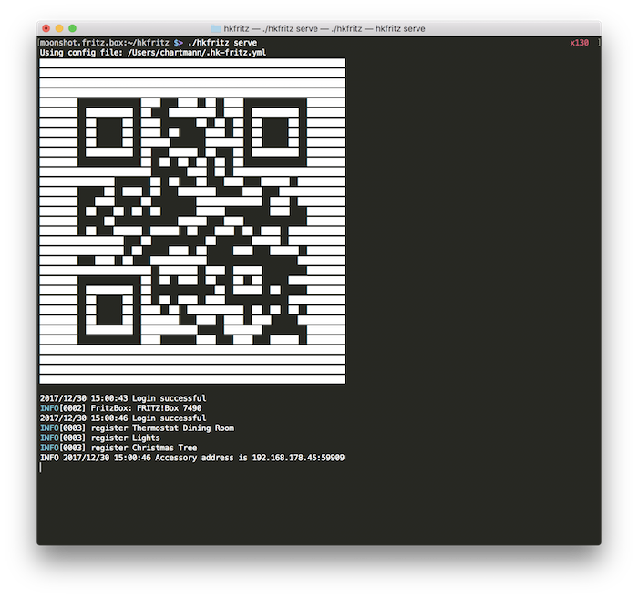

That is all we need. Next step will be to configure Apple's Home app.

## Run on Raspberry Pi

Instead of running the bridge on your desktop system, you can easily run this on a headless server like the Raspberry PI. Just install and run [Raspbian](https://www.raspberrypi.org/downloads/raspbian/) and follow the [installation guide](https://www.raspberrypi.org/documentation/installation/installing-images/README.md). Next, prepare [SSH access](https://www.raspberrypi.org/documentation/remote-access/ssh/) to your Raspi. I had to re-setup the openssh server via `sudo rm /etc/ssh/ssh_host_* && sudo dpkg-reconfigure openssh-server`. Now we are ready to run our bridge. Lets download our bridge. Be aware that Raspberry Pi is running on ARM instead on Intel/AMD. Therefore, we need to download the arm6 binary. 

```
mkdir hkfritz
curl -L https://github.com/chris-rock/homekit-fritz/releases/download/0.1.5/homekit-fritz_0.1.5_linux_armv6.tar.gz | tar -xvzf -
```

The next steps are the same as above, we configure the bridge and start the service.

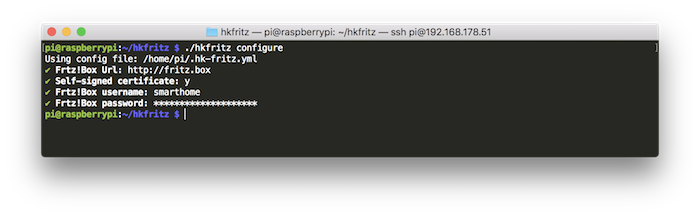
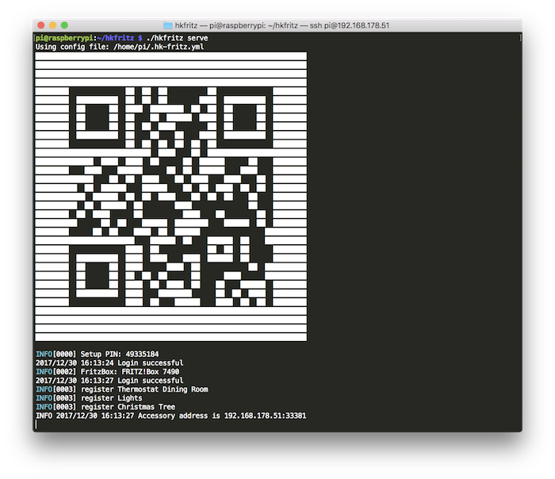

## Configure Home app

The configuration of the Home app is straight forward. Just setup your rooms first. Once you've done this, push the *Add Accessory* button and point your iPhone to the QR on your terminal. For this to work, your iPhone needs to be on the same network as your Fritz!Box and HomeKit bridge.

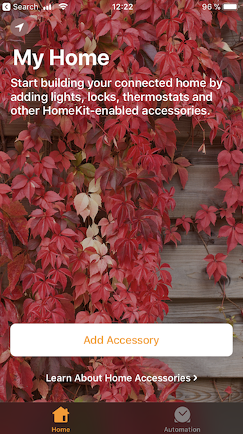

<div style="clear: both;padding-bottom:20px;"></div>

During the setup, you are guided through all smart home devices registered with your Fritz!Box. If you want to run actions on rooms, you should add the proper room to the device.

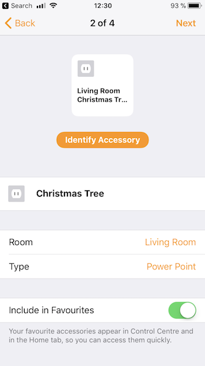
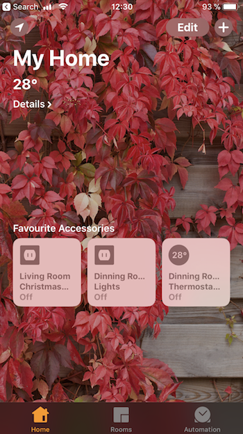
<div style="clear: both;padding-bottom:20px;"></div>

We are ready to push buttons within your Home app to manipulate your smart home devices.

## Talk to Siri

Since everything is configured properly, let's try Siri:

* Siri, *heat up* the dining room to *24 degrees celsius*

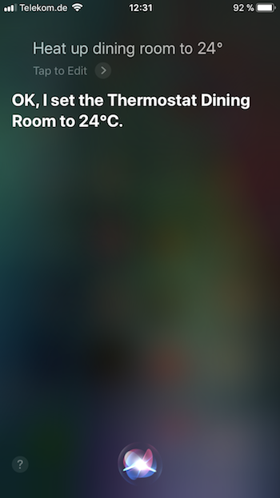
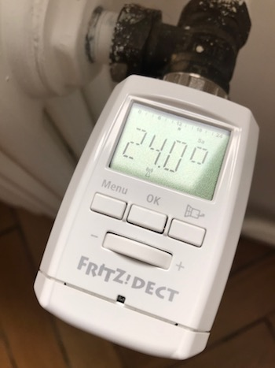
<div style="clear: both;padding-bottom:20px;"></div>

* Siri, *turn on* the Christmas tree


<div style="clear: both;padding-bottom:20px;"></div>

## Conclusion

This was a fun project. It included a bunch of technology to get everything running. Go is the perfect companion for arm development. The cross-compilation features made the development very straight forward. I explicitly tried to run this project on a Raspberry Pi 1 and the bridge has not behaved slower than running it on a Mac. Hopefully, AVM is shipping with HomeKit capabilities by next year, until then, my Raspi has work to do :-)