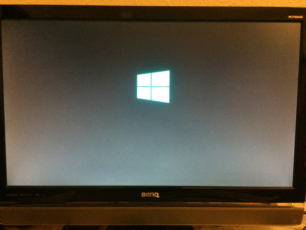
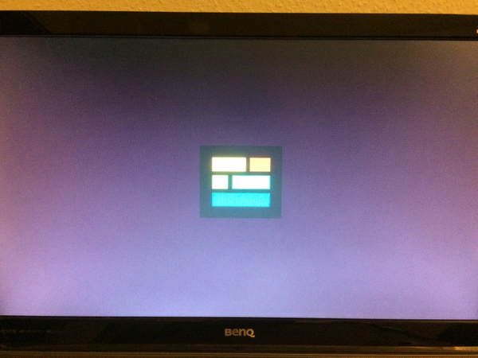
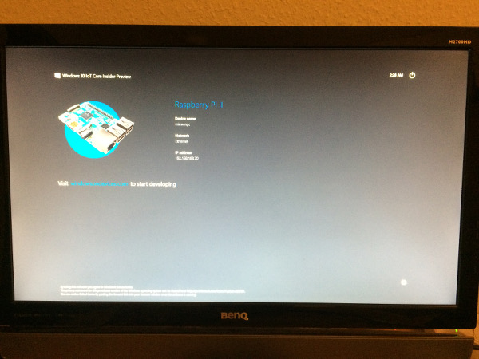
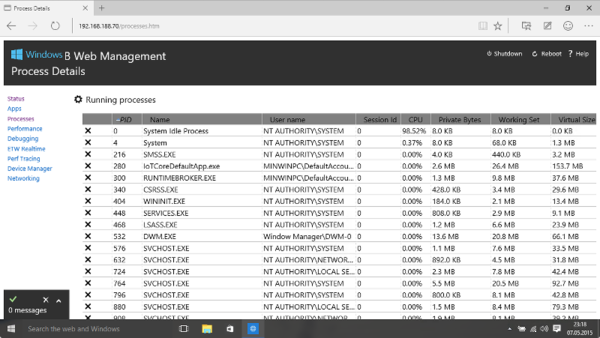
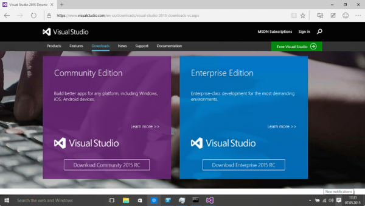
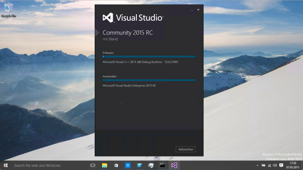
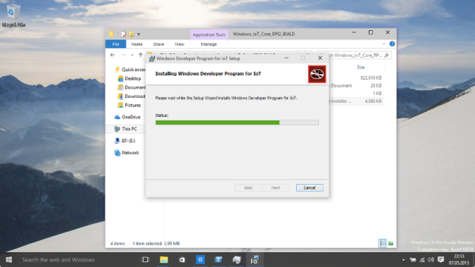

Recently, Microsoft announced its [Windows 10 IoT Core Insider Preview](http://ms-iot.github.io/content/GetStarted.htm) and it is very exiting to get an ARM version of Windows running on a small device. Microsoft did a great job to bring the operating system to smaller devices and I am looking forward to play more with their IoT solutions. Now, lets install Windows on Raspberry 2.

## Download Windows 10 IoT

Create an account at [Microsoft Connect](https://connect.microsoft.com/windowsembeddediot/SelfNomination.aspx?ProgramID=8558) and download the image [Windows_IoT_Core_RPI2_BUILD.zip](http://connect.microsoft.com/windowsembeddedIoT/Downloads/). You need to sign their `Windows Developer Program For IoT EULA` and `Windows 10 IoT Core Insider Preview EULA` located in their [survey](https://connect.microsoft.com/windowsembeddedIoT/Surveys) section.

The downloaded `Windows_IoT_Core_RPI2_BUILD.zip` contains the required `Flash.ffu`. Extract the zip file and you are ready for SD card preparation.

## Prepare SD Card

We will use Windows 10 for SD card preparation. Currently, I found no easy way to build an image (eg. with `dd`) on Linux or Mac. I recommend to use Windows 10 as a host operating system. I just deployed it on a new machine to play around with Windows 10 and Windows 10 IoT.

Now, insert a blank 8GB Class 10 SD card into your computer and find your SD card with `diskpart`

```bash
Windows PowerShell
Copyright (C) 2015 Microsoft Corporation. All rights reserved.

PS C:\Windows\system32> diskpart

Microsoft DiskPart version 10.0.10074

Copyright (C) 1999-2013 Microsoft Corporation.
On computer: WIN-7ECOKTDG4QV

DISKPART> list disk

  Disk ###  Status         Size     Free     Dyn  Gpt
  --------  -------------  -------  -------  ---  ---
  Disk 0    Online          232 GB      0 B
  Disk 1    Online           59 GB      0 B        *

DISKPART> exit

Leaving DiskPart...
```

In case you do not like to command line, you could also use the graphical `Disk Management` tool. 

With help of [Microsofts Dsim](https://msdn.microsoft.com/en-us/library/windows/desktop/dd371719%28v=vs.85%29.aspx) tool, we create the image for our Raspberry 2. Be aware that you need to replace `PhysicalDriveN` with your local disk id like `PhysicalDrive1`: 

```
PS C:\Users\chris\Downloads\Windows_IoT_Core_RPI2_BUILD> dism.exe /Apply-Image 
/ImageFile:Flash.ffu /ApplyDrive:\\.\PhysicalDriveN /SkipPlatformCheck

Deployment Image Servicing and Management tool
Version: 10.0.10074.0

Applying image
[==========================100.0%==========================]
The operation completed successfully.
PS C:\Users\chris\Downloads\Windows_IoT_Core_RPI2_BUILD>
```

In case you receive an IO error, you may need to switch the physical knob to active writing for your SD card.

```bash
PS C:\Windows\system32> cd 'C:\Users\chris\Downloads\Windows_IoT_Core_RPI2_BUILD\'
PS C:\Users\chris\Downloads\Windows_IoT_Core_RPI2_BUILD> dism.exe /Apply-Image 
/ImageFile:Flash.ffu /ApplyDrive:\\.\PhysicalDriveN /SkipPlatformCheck

Deployment Image Servicing and Management tool
Version: 10.0.10074.0

Applying image
[==========================100.0%==========================]

Error: 1117

The request could not be performed because of an I/O device error.

The DISM log file can be found at C:\Windows\Logs\DISM\dism.log
PS C:\Users\chris\Downloads\Windows_IoT_Core_RPI2_BUILD>
```

Finally, remove your SD card from your computer.

## Boot in Your Raspberry Pi 2

Once everything is ready, boot your Raspberry Pi 2 and wait some minutes. Windows will boot and display a overview screen that displays all required information to connect to the device.





## Web Administration

By default, Windows IoT ships with an Web Administration interface that is available by entering the ip address of the Raspberry Pi. It displays the installed apps, running processes, current performence and debugging information.



## Install Visual Studio

To start developing for Windows IoT, [download the Visual Studio Community Edition](https://www.visualstudio.com/en-us/downloads/visual-studio-2015-downloads-vs.aspx) and installa the `Windows Developer Program for IoT Installation` that is included in `Windows_IoT_Core_RPI2_BUILD.zip`







I am looking forward to play more with Windows IoT and start deploying universal apps.
