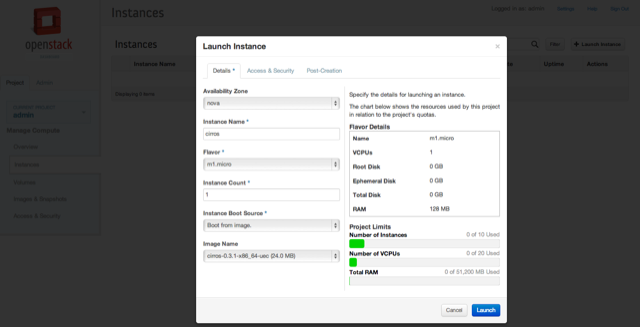

[OpenStack Havana](http://www.openstack.org/software/havana/) has just been released. It offers a bunch of new features. Everything is well documented in their [Release Notes](https://wiki.openstack.org/wiki/ReleaseNotes/Havana). It is nice to read, but I need a test drive.

We are using Open Stack heavily and test new releases via [DevStack](http://devstack.org/) before we deploy new releases in our staging environment. What would be easier than trying Havana with a [vagrant box](http://www.vagrantup.com/). You find my vagrant setup at Github https://github.com/chris-rock/vagrant-devstack.

    $ git clone https://github.com/chris-rock/vagrant-devstack.git
    Cloning into 'vagrant-devstack'...
    remote: Counting objects: 34, done.
    remote: Compressing objects: 100% (19/19), done.
    remote: Total 34 (delta 11), reused 34 (delta 11)
    Unpacking objects: 100% (34/34), done.
    Checking connectivity...done
    $ cd vagrant-devstack
    $ vagrant up

After a cup of tea you should have the following:

    Horizon is now available at http://192.168.50.10/
    Keystone is serving at http://192.168.50.10:5000/v2.0/
    Examples on using novaclient command line is in exercise.sh
    The default users are: admin and demo
    The password: devstack
    This is your host ip: 192.168.50.10

Now you type `http://192.168.50.10` in your browser and log into the OpenStack environment with `admin` and `devstack`.

Then click on the project `demo` or `admin` on the left hand.

Start creating your instance and select the Cirros OS as an image. Of course you could upload new images via

     glance image-create --name YourImage --container-format ovf --disk-format qcow2 --file image_openstack_image.img --is-public True

After your created the machine, the image will be spawned.

Click on the machine details and the console log to see the progress of the machine.

Finally log into the machine via the NoVNC client.

In case you find bugs, I am happy to merge [pull requests](https://github.com/chris-rock/vagrant-devstack).

