This example demonstrates how to implement continuous compliance in AWS environments with [InSpec](https://www.inspec.io/), [Chef](https://www.chef.io/chef/) and [Chef Automate](https://www.chef.io/automate/).

## Overview

The demo is based on a [webinar](https://youtu.be/4dvN9IsKSgc) presented by [Mark Rambow](https://twitter.com/markhasread) and [me](https://twitter.com/chri_hartmann). This post follows the pattern of the webinar by showcasing how continuous compliance is applied with AWS OpsWorks. Since OpsWorks is based on Chef Automate, it works very similar with Chef Automate standalone.

The example is split in three sections:

 * Setup continuous compliance on one new instance
 * Scale continuously with auto-scaling
 * Use a custom InSpec profile

Let's get started.

## Preparation

We need some pieces upfront:

* A running [OpsWorks Chef Automate](https://aws.amazon.com/opsworks/chefautomate/) instance
* [IAM roles and policies](https://docs.aws.amazon.com/opsworks/latest/userguide/opscm-unattend-assoc.html#opscm-create-instance-profile) are setup, see FAQ
* [ChefDK](https://downloads.chef.io/chefdk) is installed on your workstation
* [OpsWorks StarterKit](https://github.com/chris-rock/opsworks-example)

Note: This kit does not include the `.chef` directory since it contains private credentials. The `userdata.sh` and `userdata.ps1` are not generated for your environment. You need to [adapt it](https://docs.aws.amazon.com/opsworks/latest/userguide/opscm-unattend-assoc.html#w2ab2b9c27c19) or replace it with the one from your starter kit.

## Get Started

As the first step, we need to download the kit and upload all cookbooks to the Chef Server that is embedded in OpsWorks.

```bash
# clone repository
git clone git@github.com:chris-rock/opsworks-example.git

# ensure .chef directory is there or chefdk is 

# bundles all cookbooks and dependens from Berksfile in cookbooks directory
$ berks vendor cookbooks

# upload all cookbooks to Chef Server
$ berks upload
```

### Detect and Correct for one AWS instance

**See Chef client reporting to Automate**

We are ready to define the Chef role that we want to apply to our new EC2 instance. Adapt the role `roles/webserver.rb` to ensure it looks like:

```ruby
name "webserver"
description "Example webserver"

run_list(
  "recipe[chef-client]",
  "recipe[nginx]",
  "recipe[inspec-page]",
)
```

This role configures the chef-client, installs nginx and setups the inspec page in nginx. The operating system is not hardened in that example yet. Upload the role to Chef Server:

```
$ knife upload role roles/webserver.rb
Created roles/webserver.json
```

We've done all the require preparation and we are ready to start our first Amazon Linux instance. I've used the Amazon Linux 2017.09 with t2.micro. SSH and HTTPs are the only entries required in your security group configuration. When you reach the instance details section, please make sure the correct IAM instance profile is selected and the userdata contains your role `RUN_LIST="role[webserver]"`.

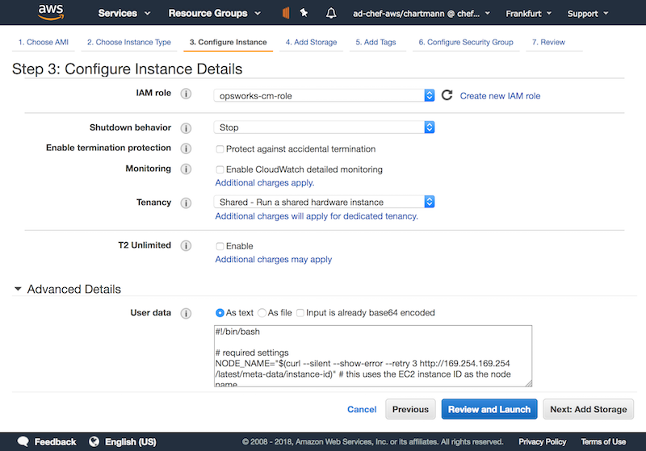

Once the instance is up and running, `chef-client` is executed automatically since it was configured in userdata. The clients pulls the required Chef role and the cookbooks from Chef Server

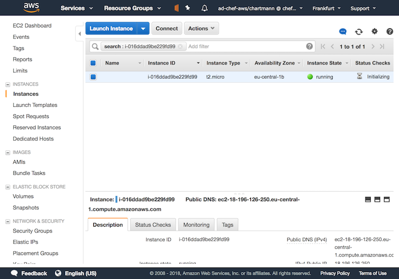

Once the `chef-client` finished its first run, you see instance reporting its run list to Chef Automate.

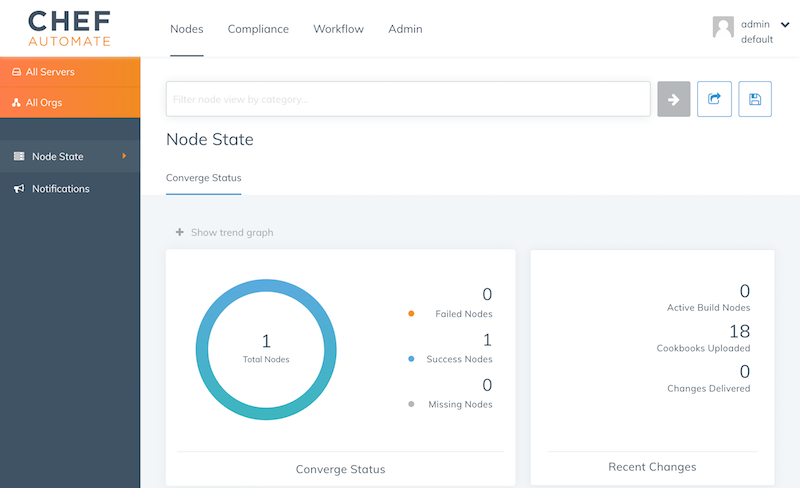

**Run audit scan**

So far, we configured the automation, but not compliance scans. We are going to apply the [DevSec](http://dev-sec.io/) SSH Baseline. In Automate's compliance profile section, load the profile into your namespace. The DevSec profiles are part of the Chef Automate package.

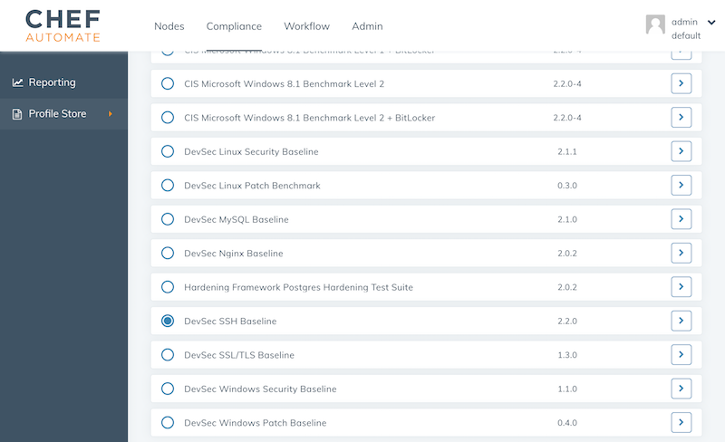
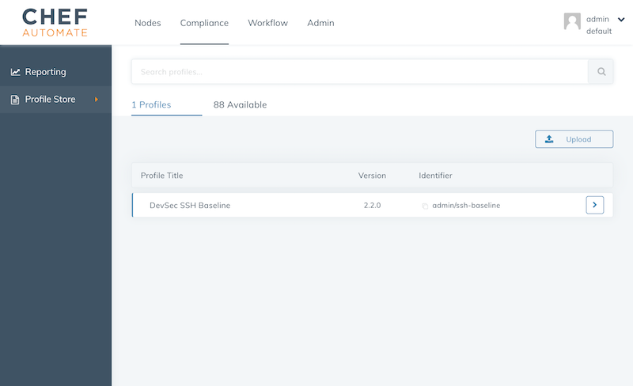

Once the profile is in your namespace, update the `webserver` role with the [audit cookbook](https://github.com/chef-cookbooks/audit) and ensure the audit cookbook is uploaded to the Chef Server by adding it to the `Berksfile`: 

```ruby
cookbook 'audit'
```

If you changed the Berksfile, run

```bash
$ berks vendor cookbooks
$ berks upload
```

To configure the `audit` cookbook, adapt the role as following:

```ruby
name "webserver"
description "Example webserver"

default_attributes "audit" => {
    "reporter" => "chef-server-automate",
    "profiles" => [
        {
            "name": "ssh-baseline",
            "compliance": "admin/ssh-baseline"
        },
    ]
}

run_list(
  "recipe[chef-client]",
  "recipe[nginx]",
  "recipe[inspec-page]",
  "recipe[audit]"
)
```

The run list includes `"recipe[audit]"` now and the `audit` attributes let the audit cookbook know to use its `chef-server-automate` reporter. All the InSpec reports are sent via the Chef Server to Chef Automate. `admin/ssh-baseline` is the namespace that you see in Chef Automate's profile overview. Once everything is setup properly, you see the ssh baseline reporting to Chef Automate.

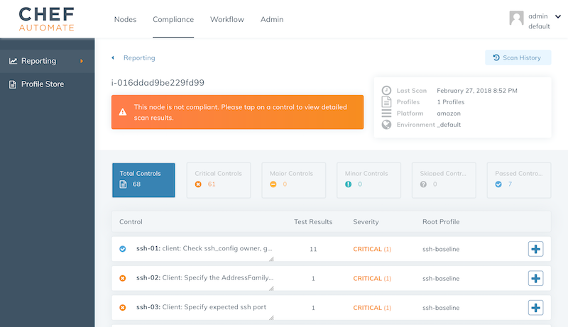

**Apply server hardening**

Of course, we do not want to tackle the server hardening manually. There is a cookbook for that and we are applying the [DevSec SSH hardening cookbook](https://github.com/dev-sec/chef-ssh-hardening/) via our run list.

```ruby
name "webserver"
description "Example webserver"

default_attributes "audit" => {
    "reporter" => "chef-server-automate",
    "profiles" => [
        {
            "name": "ssh-baseline",
            "compliance": "admin/ssh-baseline"
        },
    ]
}

run_list(
  "recipe[chef-client]",
  "recipe[ssh-hardening]",
  "recipe[nginx]",
  "recipe[inspec-page]",
  "recipe[audit]",
)
```

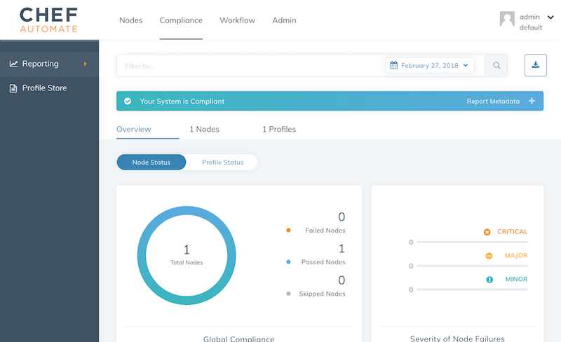
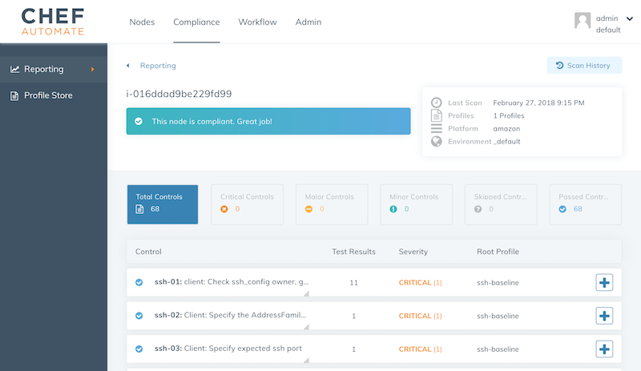

### Scale continuous compliance with autoscaling

We've prepared everything you need. To scale the detection and correction automatically, we are going to apply the role for more servers. In practice you would tie the application deployment with the hardening in one role, but we keep it for simplicity.

As the first step, we are creating a new auto scaling group with a new launch configuration:

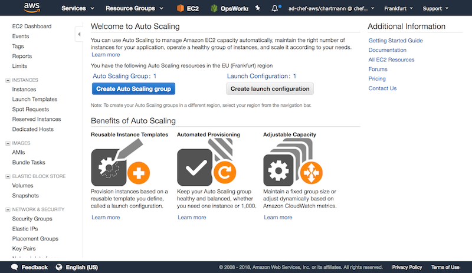
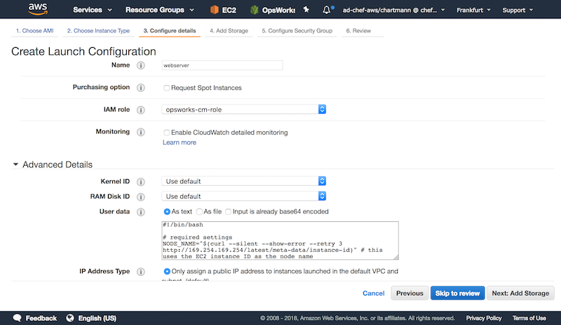

Setup the correct security group for each instance:
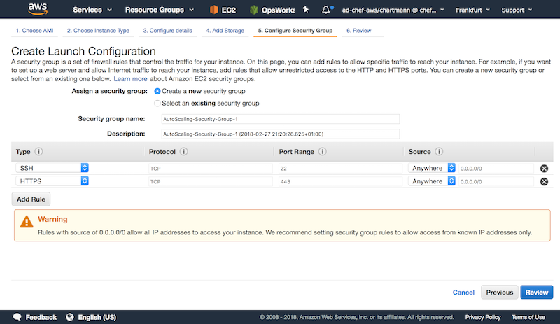

Add custom tags for your auto scaling group:

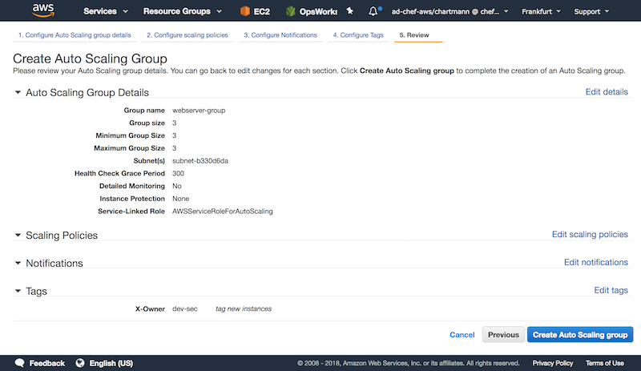

Once everything is configured, AWS will launch new instances that spin up Chef to harden the system and verify the compliance state with InSpec.

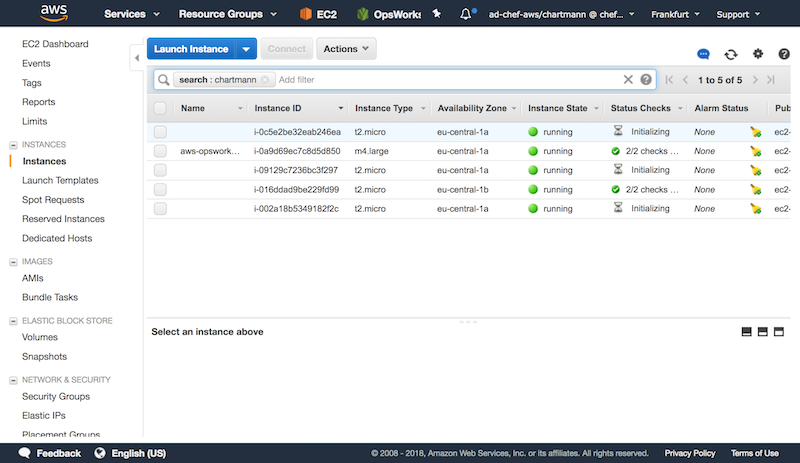

By combining InSpec for detection with Chef for hardening, we are able to scale our secure infrastructure effortless.

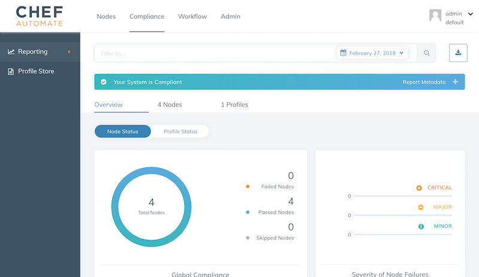

### Use custom profile

In most cases, the built-in [CIS](https://www.cisecurity.org/) and [DevSec](http://dev-sec.io/) profiles help users to meet about 80% of their compliance goals. InSpec is very flexible and allows you to implement [aggregated profiles](http://lollyrock.com/articles/chef-compliance-meta-profiles/) or [profile overlays](https://www.inspec.io/docs/reference/profiles/#using-controls-from-an-included-profile). If you have in-house applications or custom requirements, InSpec is the tool that helps you to implement those as well. In our case, we are using a profile that allows us to verify instance tags.

```bash
# clone the InSpec profile to verify EC2 metadata
git clone git@github.com:chris-rock/ec2-example-profile.git

# package the InSpec profile for an upload
inspec archive ec2-metadata-example
```

Now, we are going to upload the generated `tar.gz` file to Chef Automate:

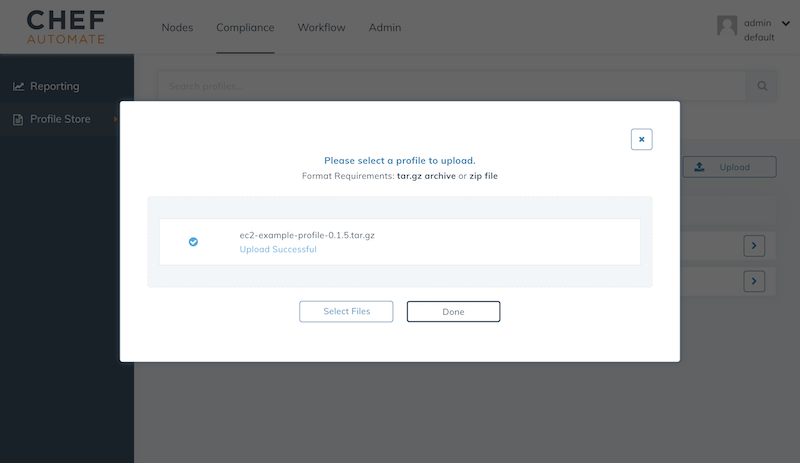

Once the profile is upload to Chef Automate, we simply need to update your role and add the new `admin/ec2-example-profile` profile.

```ruby
name "webserver"
description "Example webserver"

default_attributes "audit" => {
    "reporter" => "chef-server-automate",
    "profiles" => [
        {
            "name": "ssh-baseline",
            "compliance": "admin/ssh-baseline",
        },{
            "name": "ec2-example-profile",
            "compliance": "admin/ec2-example-profile",
        }
    ]
}

run_list(
  "recipe[chef-client]",
  "recipe[ssh-hardening]",
  "recipe[nginx]",
  "recipe[inspec-page]",
  "recipe[audit]",
)
```

The next time the `chef-client` executes on each node, the profile will be executed automatically.

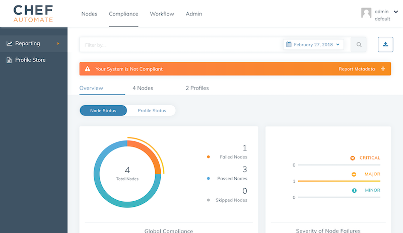


## Summary

This post demonstrated the implementation of compliance measures in your fleet by integrating InSpec into your DevOps workflow. If you have any question, do not hesitate to raise an issue in my [opsworks example](https://github.com/chris-rock/opsworks-example).

## FAQ

**How do I setup instance permissions**

The used cloudinit userdata requires access to the AWS api via the AWS Cli. Setup the following policy named eg. `opsworks-cm` in AWS. Attach this policy to a role named `opsworks-cm-role`.

```json
{
  "Version": "2012-10-17",
  "Statement": [
    {
      "Action": [
        "opsworks-cm:AssociateNode",
        "opsworks-cm:DescribeNodeAssociationStatus",
        "ec2:DescribeTags",
      ],
      "Effect": "Allow",
      "Resource": [
        "*"
      ]
    }
  ]
}
```

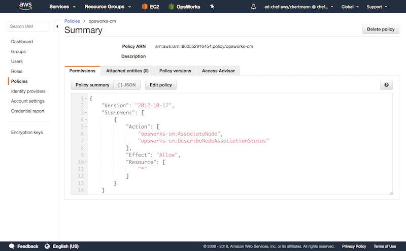
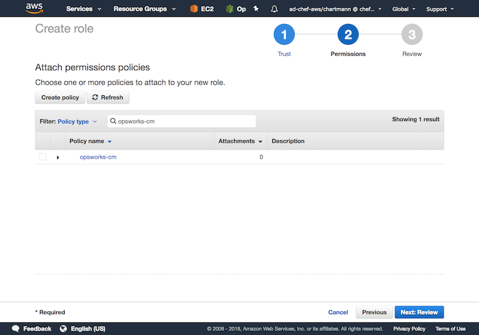


**My node is not showing up in Chef Automate?**

If the instance does not report to Chef Automate, it is very likely a AWS API permission issue. If you see an issue like

```
An error occurred (AccessDeniedException) when calling the AssociateNode operation:
User: arn:aws:sts::862552916454:assumed-role/aws-opsworks-cm-ec2-role/i-022db13089f495a34
is not authorized to perform: opsworks-cm:AssociateNode on resource:
arn:aws:opsworks-cm:eu-central-1:862552916454:server/opsworks/*
```

in your `/var/log/cloud-init-output.log` you need to ensure the instance has the correct IAM instance profile as explain on [AWS docs](https://docs.aws.amazon.com/opsworks/latest/userguide/opscm-unattend-assoc.html#opscm-create-instance-profile
).