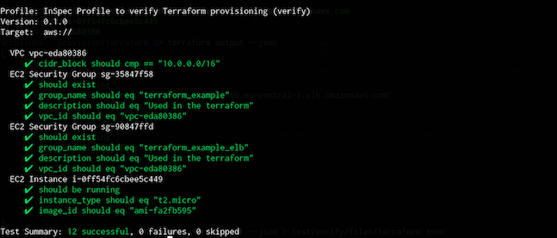

We want to bring the same testing experience known from configuration management to provisioning and InSpec 2.0 is making it happen. We are going to explain why it is important and how you can use Terraform with InSpec.

## Overview

Until today, it was not easy to verify that all your provisioned infrastructure is working properly. While InSpec 1.x is great at covering your operating system configuration and runtime, it was lacking native support for cloud environments e.g. to verify security groups or IAM permissions. A few days ago, [InSpec 2.0](https://blog.chef.io/2018/02/20/announcing-inspec-2-0/) has been released and it adds support for cloud resources. Equipped with its new features, we are enabled to verify our infrastructure provisioned with [Terraform](https://www.terraform.io/), [AWS CloudFormation](https://aws.amazon.com/cloudformation/) or [Azure Resource Manager Templates](https://azure.microsoft.com/en-us/resources/templates/).

## Why do we need to test provisioned infrastructures

When we think about infrastructure automation, most likely we think about configuration management like Ansible, Chef and Puppet. With the rise of IaaS/cloud infrastructures such as VmWare, AWS, Azure or GCP, we started to automate complete infrastructure stacks. Besides pure configuration management of instances, those stacks include all pieces required to run our application like dns and firewall configuration. This allows us to replicate complete environments automatically, consistently and very rapidly. By doing configuration management  over the past decade, we learned that we need to think about the development and deployment lifecycle. The same is true for those stacks. To ensure quality and reliability during rapid change, testing is required to establish trust for the automation:

- **safety at velocity**: you can deploy changes to all parts of your infrastructure with confidence since testing is included. teams working together on a tech stack, are able to prevent changes that break your environment
- **negative testing**: ensure things that should not be in your stack e.g you may want to ensure that all your machines are not reachable by unknown ip addresses. This cannot easily be achieved with provisioning tools
- **continuous release**: automation in combination with infrastructure testing allows you to have a build pipeline that sets up testing and staging environment to ensure that your system keeps working as intended

##  Recap: Automating Compliance - The birth of InSpec

Before InSpec, [Dominik Richter](http://arlimus.github.io) and I developed SaaS services that had to comply with German regulations. We learned the hard way how difficult it is to pass audits since the tooling was just not there. Based on our experience, we started the development of InSpec eventually. From day one, we worked with developers, operations and auditors to cover the needs for infrastructure and compliance testing. The main goal during InSpec’s inception was to bring compliance into the world of automation. We did some key design decisions very early on: 

* Make test language and profiles available to all teams dealing with infrastructure
* Easy to use, easy to see results
* Combine a testing language with native support for test collections (aka profiles) 
* Built-in but optional control metadata
* Run any test locally and remotely
* Enable easy integration into any CI/CD pipeline

Those early design decisions made InSpec very successful. We work with companies and government agencies that have the most rigid compliance requirements. They need to comply with PCI, HIPPA and STIGs or any combination of those. Only with InSpec, they have been successful to bring development, operations and compliance teams together by harmonized the testing language across teams. 


In InSpec, a test like

```
SSH supports two different protocol versions. The original 
version, SSHv1, was subject to a number of security issues. 
Please use SSHv2 instead to avoid these.
```

turns into

```ruby
describe sshd_config do
  its('Protocol') { should eq('2') }
end
```

If required, additional metadata can be providing:

```ruby
control 'sshd-10' do
  impact 1.0
  title 'Server: Specify protocol version 2'
  desc "Only SSH protocol version 2 connections should be permitted. Version 1 of the protocol contains security vulnerabilities. Don't use legacy insecure SSHv1 connections anymore."
  describe sshd_config do
    its('Protocol') { should eq('2') }
  end
end
```

This is enough code to run it againt a system via:

```bash
# run test locally
inspec exec test.rb

# run test on remote host on SSH
inspec exec test.rb -t ssh://user@hostname -i /path/to/key

# run test on remote windows host on WinRM
inspec exec test.rb -t winrm://user@hostname --password 'your-password'

# run test on docker container
inspec exec test.rb -t docker://container_id
```

Further information about InSpec and profiles is available on [inspec.io](https://www.inspec.io/)

## InSpec goes beyond machine-based testing

When we started the development of InSpec, the infrastructure and compliance testing space was all focused on configuration and runtime verification. By working very closely with users, we quickly realized that a shift in the industry is happening: compliance requirements shift from operating systems to their management system. The classic example for that change is a firewall configuration. In the past, we configured every firewall rules on each operating system. In IaaS setups, you setup network and security group configuration along with your instance when you deploy it but not at the operating system level. The compliance rules stay valid, but they moved to the system that manages the virtual infrastructure. Therefore we want to describe something like:

```
describe aws_security_group("sg-12345678") do
  it { should exist }
end
```

As shown above, InSpec is able to execute tests locally or remotely via ssh, winrm or Docker connection.  While this is already very flexible, it does not fit our use case. It would feel strange to the user to write a test like a security group verification and run that test against an operating system. The syntax would feel right, but it is neither checking a local or remote operating system configuration. 

Faced with that challenge, we stepped back from any specific coding and thought about a tool that would just focus on cloud testing. After some usability testing, we figured that:

* we would still use the same language to describe tests
* we would still write a profile to share test collections
* we would still need similar reporting capabilities

The main difference would be the communication to the system that we are checking. We would want to talk to the API directly and it should look like:

```
# run test against aws api
inspec exec test.rb -t aws://profile
```

Dominik specified our thought process in what we called [Platform RFC](https://github.com/chef/inspec/issues/1661). The radical shift here is that InSpec 1.0 took an operating system for granted, while InSpec 2.0 only knows platforms. Each platform has a supported API. In that sense, an operating system is becoming the special case. By doing all the hard work behind the scenes, we were able to extend the capabilities of InSpec without compromising on the user experience, since:

- resources know the platform they support
- test executed against the wrong platform are automatically skipped
- all existing profile management and reporting keeps the same
- backward compatibility with InSpec 1.0
- we can aggregate profiles for different platforms in a meta-profile (operating system and APIS)

InSpec 2.0 adds initial platform support for AWS and Azure. The next part of this blog post series will demonstrate how you can InSpec 2.0 in combination with Terraform.


## InSpec + Terraform


The following example is based on the [Basic Two-Tier AWS Architecture](https://github.com/terraform-providers/terraform-provider-aws/tree/master/examples/two-tier) example. It provides a template for running a simple two-tier architecture on AWS. Once Terraform created the environment, a stateless nginx server is running behind an Elastic Load Balancer on AWS. To get this example running, you just have to run `terraform apply`. We are going to extend this example to eliminate the manual testing. The extended example is available on [Github]((https://github.com/chris-rock/inspec-verify-provision).

Within the Terraform directory run `inspec init profile test/verify` to create a new empty InSpec profile. Then adapt the `inspec.yml` to reflect your use case. As a next step, we are going to add tests. For each Terraform resource

```
resource "aws_security_group" "default" {
  name        = "terraform_example"
  description = "Used in the terraform"
  vpc_id      = "${aws_vpc.default.id}"

  ...
}
```

you can write an test that uses available [InSpec resources](https://www.inspec.io/docs/reference/resources/)

```
describe aws_security_group(group_name: 'terraform_example') do
  it { should exist }
  its('group_name') { should eq 'terraform_example' }
  its('description') { should eq 'Used in the terraform' }
  its('vpc_id') { should eq VPC_ID }  
end
```

For some tests, we need data from Terraform. The best hand-over at this point is the use of [terraform output](https://www.terraform.io/intro/getting-started/outputs.html) variables. Define the variables that you need as an output in Terraform:

```
output "vpc_id" {
  value = "${aws_vpc.default.id}"
}
```

Terraform has a neat built-in feature that allows the output of the variables as json file.

```
terraform output --json > test/verify/files/terraform.json
```

InSpec is able to [load files from profiles](https://github.com/chef/inspec/issues/1396) if they are located in the `files` directory directly:

```
# load data from Terraform output
content = inspec.profile.file("terraform.json")
params = JSON.parse(content)

# store vpc in variable
VPC_ID = params['vpc_id']['value']

# you can use the variable in various spaces

describe aws_vpc(vpc_id: VPC_ID) do
  its('cidr_block') { should cmp '10.0.0.0/16' }
end

describe aws_security_group(group_name: 'terraform_example') do
  it { should exist }
  its('group_name') { should eq 'terraform_example' }
  its('description') { should eq 'Used in the terraform' }
  its('vpc_id') { should eq VPC_ID }  
end
```

This allows us to use any data from Terraform in InSpec. We are ready to provision the infrastructure and run InSpec checks afterwards. To see everything in action:

```
# clone repository
git clone git@github.com:chris-rock/inspec-verify-provision.git
cd inspec-verify-provision/terraform

# download the required plugins
terraform init

# run terraform to apply the changes
terraform apply -var 'key_name=terraform' -var 'public_key_path=/Users/chris/.ssh/id_rsa.pub'

# make terraform variables available to inspec
terraform output --json > test/verify/files/terraform.json

# run the inspec profile to verify the setup
inspec exec test/verify -t aws://
```



## Wrap-Up

This post covered why provisioning testing is important and demonstrate its use with Terraform. We know that not all required resources are available yet. Please help us to extend the coverage and do not hesitate to contact me for any feedback.

Going forward we want to improve the Terraform experience by reusing the InSpec attributes for loading variables in InSpec. This will allow you to reuse the same InSpec profile in different contexts.

Follow-up posts will cover AWS Cloudformation and Azure Resource Manager templates in conjunction with InSpec.

I hope this was helpful. Have a happy automation day.

## Kudos

I’d like to thank the InSpec team and all contributors to inspec-aws and inspec-azure repository for making this happen.